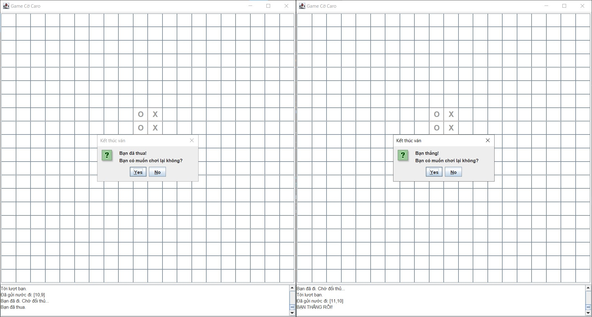

# 🎮 Đồ Án: Game Cờ Caro Online (Java Socket)

Ứng dụng game Cờ Caro 2 người chơi theo mô hình Client-Server, sử dụng Java Socket. Hỗ trợ tìm trận tự động, chat thời gian thực và xử lý logic chơi lại.

---

## 🚀 Giới thiệu

Dự án được xây dựng nhằm minh họa kiến thức về Lập trình mạng:
* **Kiến trúc Hybrid:** Kết hợp **TCP** (để xử lý logic game, nước đi an toàn) và **UDP** (để xử lý tính năng Chat tốc độ cao).
* **Multithreading:** Server sử dụng đa luồng để xử lý nhiều cặp người chơi cùng lúc.
* **Giao diện:** Sử dụng Java Swing.

---

## ✨ Tính năng nổi bật

1.  **Gameplay:**
    * Bàn cờ tiêu chuẩn 20x20 ô.
    * Luật chơi cơ bản: 5 ô liên tiếp (Ngang, Dọc, Chéo) là thắng.
    * Hiển thị lượt đi rõ ràng (X và O).
2.  **Hệ thống Mạng:**
    * **Matchmaking:** Tự động ghép cặp người chơi vào hàng chờ.
    * **Chat UDP:** Nhắn tin trò chuyện giữa 2 người chơi qua giao thức UDP (Port 7777).
3.  **Xử lý Trạng thái:**
    * **Rematch (Chơi lại):** Cơ chế đồng thuận (cả 2 cùng nhấn Có) để reset ván đấu.
    * **Disconnect Handling:** Tự động thông báo và kết thúc game nếu đối thủ thoát đột ngột.

---

## 🛠️ Cài đặt & Cấu hình (Localhost)

Dự án được cấu hình mặc định để **chạy thử nghiệm trên cùng một máy tính**.

---

## Hướng dẫn cài đặt
1. * Đầu tiên phải chạy File SeverApp.java trong thư mục src/server
    * Hoặc có thể chạy lệnh sau trong terminal : java -jar bin/Server.jar
2. * Sau đó chạy file ClientApp.java trong thư mục src/client
    *  Hoặc có thể chạy lệnh sau trong terminal :java -jar bin/Client.jar
    * Lưu ý phải chạy 2 lần để kết nối với trò chơi